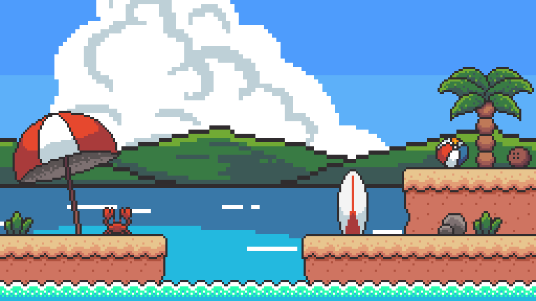
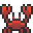

<!--truncate-->

## Videojuegos con JavaScript

Hola y bienvenido a esta nueva serie de tutoriales donde aprenderás a desarrollar videojuegos con JavaScript.

Existen muchas herramientas para crear videojuegos, como [Unity](https://unity.com/es), [Godot](https://godotengine.org/), [Phaser](https://phaser.io/), etc. Algunas son de pago y otras de código abierto, algunas son basados en lenguajes de programación como `c++` o `c#` y otras están basadas en `Javascript`.

En esta serie de tutoriales nos centraremos en el desarrollo de videojuegos con JavaScript.

## ¿Por qué usar Javascript puro para crear videojuegos?

Creo que la mejor forma de aprender una tecnología es conociendo sus bases. Es por eso que recomiendo aprender a desarrollar videojuegos con `vanilla Javascript` o Javascript sin librerías. De esta forma entenderás los conceptos que hay detrás de cada framework o librería de desarrollo de videojuegos con Javascript. Así, cuando empieces a utilizar alguna de estas herramientas te será mucho más fácil entenderla.

Este camino puede parecer más difícil de entender, y más largo de recorrer, pero créeme, valdrá la pena. Tu comprensión sobre Javascript y su aplicación en los videojuegos será mucho más extensa si empiezas primero por las bases antes de saltar a alguna framework o librería.

Como siempre te iré enseñando paso a paso y de la forma más didáctica posible para que cada concepto sea comprensible. Empezaremos armando pequeños proyectos inicialmente para luego si pasar a demos y videojuegos completos. También aprenderemos a cómo publicarlos en diferentes plataformas de videojuegos.

¿Te suena interesante la idea? empecemos con el primer tutorial aquí.

