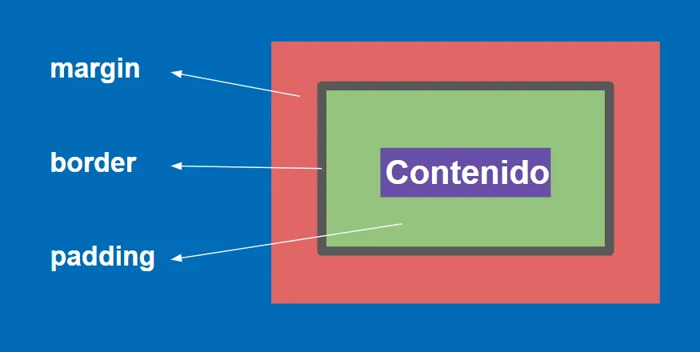

# 🟧 Modelo de caja en CSS

Cada elemento en CSS (`div` o etiqueta semántica como `header` o `footer`) tiene un modelo de caja que se encarga de mostrar el contenido de ese elemento. Para entender el modelo de caja en CSS hay que tomar en cuenta todos los espacios que puede tener un elemento en CSS. Estos espacios son los siguientes:

- `margin` Margen exterior al borde de un elemento.
- `border` Borde del elemento.
- `padding` Espacio entre el borde del elemento y el contenido.



:::info[Importante]
Si un elemento no tiene especificado un borde, no quiere decir que el modelo de caja deja de funcionar. Los espacios de `margin` y `padding` se siguen tomando en cuenta
:::

La forma simple en la que aplicarías estos espacios en CSS es la siguiente:

```css
h1 {
  margin: 16px;
  border: 1px;
  padding: 4px;
}
```

En el ejemplo anterior se está especificando un sólo valor por cada propiedad. En el margen por ejemplo se tiene el valor de `16px`, lo que va a crear un margen tanto en la parte inferior, superior y los lados de `16px`.

## Valores por separado

Si queremos especificar espacios diferentes en cada lado, lo podemos hacer de la siguiente manera:

- `margin-top:` Margen superior.
- `margin-bottom:` Margen inferior.
- `margin-left:` Margen izquierdo.
- `margin-right:` Margen derecho.

Lo mismo aplica para el `border`:

- `border-top:` Borde superior.
- `border-bottom:` Borde inferior.
- `border-left:` Borde izquierdo.
- `border-right:` Borde derecho.

y con `padding`:

- `padding-top:` Espacio entre el borde superior y el contenido.
- `padding-bottom:` Espacio entre el borde inferior y el contenido.
- `padding-left:` Espacio entre el borde izquierdo y el contenido.
- `padding-right:` Espacio entre el borde derecho y el contenido.

## Valores en una línea

Te puede ahorrar líneas de código si aplicas los valores de la siguiente forma.

- `margin: 16px 32px 64px 128px;` aplica un margen de:

  - `16px` a la parte superior.
  - `32px` a la derecha.
  - `64px` abajo.
  - `128px` a la izquierda.

- `margin: 16px 32px 64px;` aplica un margen de:

  - `16px` a arriba,.
  - `32px` a la izquierda y derecha.
  - `64px` abajo.

- `margin: 16px 32px;` aplica un margen de:
  - `16px` arriba y abajo.
  - `32px` izquierda y derecha.
- `margin: 16px;` aplica un margen de `16px` a todos los lados.

:::note[Nota]
Si te fijas bien, cuando tienes cuatro valores, cada uno de ellos se van aplicado en el sentido de las manecillas del reloj. Es decir primero arriba, derecha, abajo y luego izquierda.
:::

Lo anterior aplica también para los `margin` y `padding`.

## Espacios entre elementos

Los márgenes entre elementos se suman siempre y cuando estén uno al lado del otro. Si los elementos están uno debajo del otro, entonces el margen entre ellos será el del elemento que tenga el margen mayor. Esto es exclusivo de los márgenes.


## Explicación en video

¿Te gustaría ver ejemplos de cómo aplicar las propiedades anteriores? Haz clic en el video:

<iframe width="100%" height="444" src="https://www.youtube.com/embed/c3Ok7uIKwU8?si=ldGIyePH7wol2jgN" title="YouTube video player" frameborder="0" allow="accelerometer; autoplay; clipboard-write; encrypted-media; gyroscope; picture-in-picture; web-share" referrerpolicy="strict-origin-when-cross-origin" allowfullscreen></iframe>
