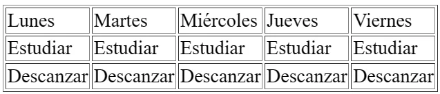
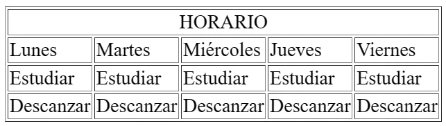

# 🏁 Tablas en HTML

En HTML, las tablas se crean con la etiqueta `table` y los elementos de la tabla se crean con la etiqueta `tr` y `td`.

```html
<table border="1">
  <tr>
    <td>Lunes</td>
    <td>Martes</td>
    <td>Miércoles</td>
    <td>Jueves</td>
    <td>Viernes</td>
  </tr>
  <tr>
    <td>Estudiar</td>
    <td>Estudiar</td>
    <td>Estudiar</td>
    <td>Estudiar</td>
    <td>Estudiar</td>
  </tr>
  <tr>
    <td>Descansar</td>
    <td>Descansar</td>
    <td>Descansar</td>
    <td>Descansar</td>
    <td>Descansar</td>
  </tr>
</table>
```

Esto da como resultado lo siguiente:



Como puedes ver, con la etiqueta `<tr>` hemos creado una nueva fila y con la etiqueta `<td>` creamos una nueva celda.

## Expansión de celdas

Para expandir una celda, debes usar el atributo `colspan`, por ejemplo:

```html
<table border="1">
  <tr>
    <td colspan="5" align="center">Horario</td>
  </tr>
  <tr>
    <td>Lunes</td>
    <td>Martes</td>
    <td>Miércoles</td>
    <td>Jueves</td>
    <td>Viernes</td>
  </tr>
  <tr>
    <td>Estudiar</td>
    <td>Estudiar</td>
    <td>Estudiar</td>
    <td>Estudiar</td>
    <td>Estudiar</td>
  </tr>
  <tr>
    <td>Descansar</td>
    <td>Descansar</td>
    <td>Descansar</td>
    <td>Descansar</td>
    <td>Descansar</td>
  </tr>
</table>
```

Esto da como resultado lo siguiente:



:::note[Nota]
Para expandir una celda entre filas, debes usar el atributo `rowspan`.
:::

## Explicación en video

<iframe width="100%" height="444" src="https://www.youtube.com/embed/wkmTHJFMbdI?si=4ThPe_yJ9XZ0WY-Q" title="YouTube video player" frameborder="0" allow="accelerometer; autoplay; clipboard-write; encrypted-media; gyroscope; picture-in-picture; web-share" referrerpolicy="strict-origin-when-cross-origin" allowfullscreen></iframe>
