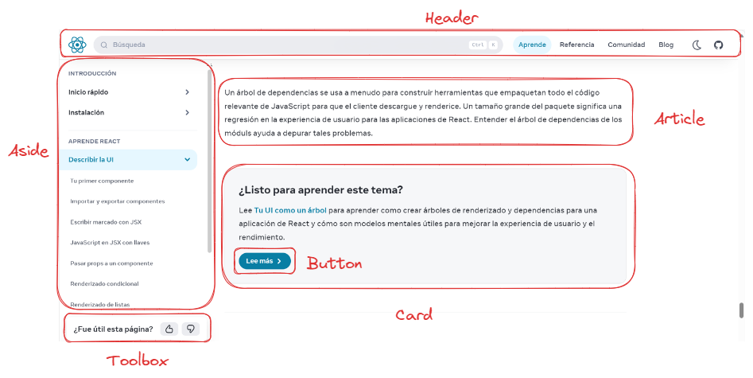

# 🐣 Tu primer componente

## ¿Qué es un componente?

Antes de comenzar a crear tu primer componente, es importante definir 
qué es un componente en React. Un componente es una pieza de código
que se encarga de manejar una parte de la interfaz de usuario.
Los componentes pueden ser reutilizados y se pueden componer para formar
interfaces más complejas.

Si te fijas en la siguiente imagen, podrás ver un ejemplo de cómo se
podría dividir una página web en diferentes componentes.



## Estructura de un componente

Un componente en React es una función que devuelve un elemento en formato JSX (Javascript + XML). A continuación, se muestra un ejemplo de un componente sencillo.

```jsx
export function App() => {
  return <h1>Hola Mundo</h1>;
}
```

Recuerda que también se puede utilizar la sintaxis de arrow function para definir un componente.

```jsx
export const App = () => {
  return <h1>Hola Mundo</h1>;
}
```

En el ejemplo anterior, se ha creado un componente llamado `App` que devuelve un elemento `h1` con el texto "Hola Mundo".

Una página real va a tener muchos componentes, asi que vamos a ver como crear otros componentes, exportarlos e importarlos en el componente principal `App`.

## Exportar un componente

Para poder utilizar un componente desde otro archivo, es necesario exportarlo. Para exportar un componente, se utiliza la palabra reservada `export` seguida de la palabra reservada `function` o `const` y el nombre del componente.

```jsx
export const Header = () => {
  return <h1>Este es el encabezado</h1>;
}
```

## Explicación en video:

<iframe width="560" height="315" src="https://www.youtube.com/embed/L85yZjdXMfM?si=Ly0Mn6veT0GubG1c" title="YouTube video player" frameborder="0" allow="accelerometer; autoplay; clipboard-write; encrypted-media; gyroscope; picture-in-picture; web-share" allowfullscreen></iframe>